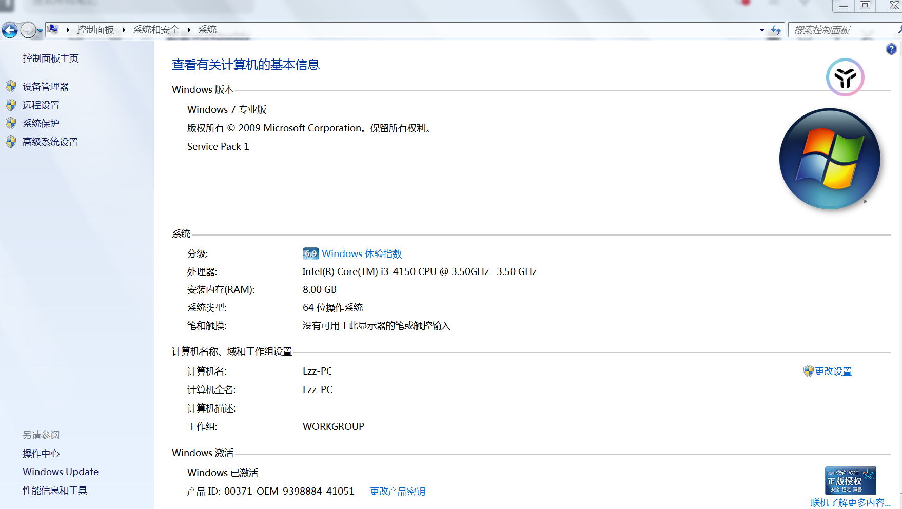
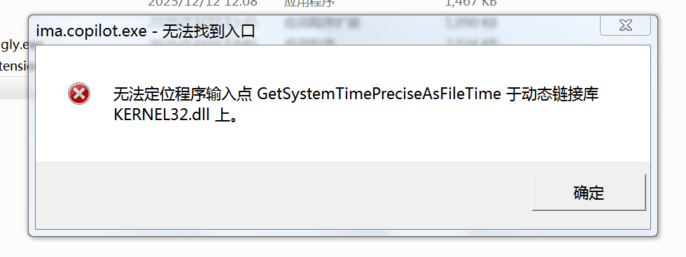
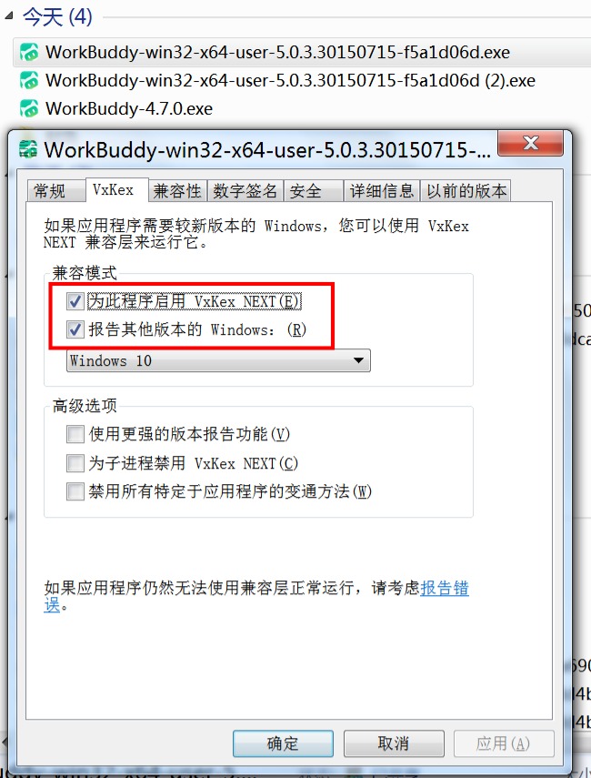
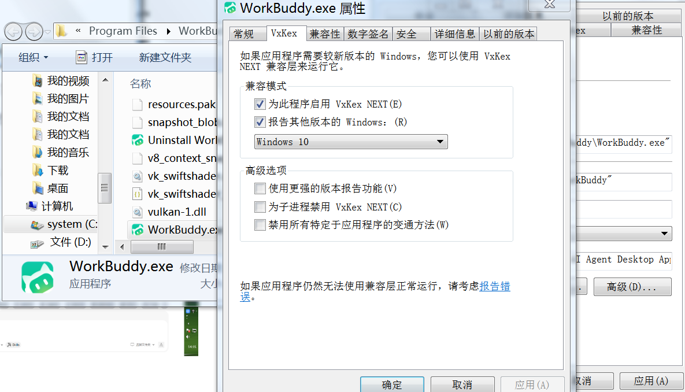
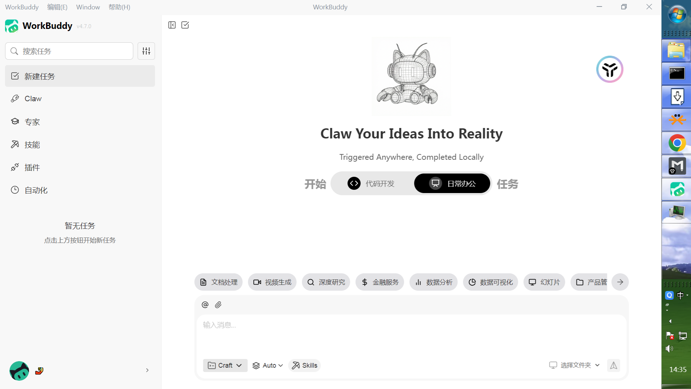

# **workbuddy win7安装**

首先我的系统是win7 sp1 x64版本，已经安装Vxkex Next。32版本的没试过！！

声明&题外话：因为办公室电脑是Win7系统，因为历史遗留原因不能升级。最近体验了各大平台agent，因为没钱买token了，只能薅羊毛用一下平台的。

 

由于Win7已经失去更新和维护，所以近些年开发的软件在Win7上面会安装不了和打开不了。所以我下载著名的Vxkex,但是部分软件就算安装了也会显示。【'**xxx.exe 无法找到入口**'——无法定位程序输入点 DiscardVirtualMemory 于动态链接库 KERNEL32.dll 上】，

      <-- 随便找个软件示例-->

于是为了安装腾讯新出的workbuddy，我从官网下载了安装包`https://www.workbuddy.cn/`，但是不能安装，就算安装也不能正常打开。

直接安装老版本也是不能正常打开。

`我用夸克网盘给你分享了「workbuddy win7安装包」，点击链接或复制整段内容，打开「夸克网盘APP」即可获取。/~69fd3YzEgw~:/ 链接：https://pan.quark.cn/s/ab0b4783ad8f     提取码：HAc5`

## **解决办法**

**准备好各安装包**  `安装包用夸克云盘准备好了`

1. Vxkex next
2. workbuddy 5.0.3.3xxx（最新版）
3. workbuddy 4.7.0（老版本—3月份）

先安装`Vxkex next`，然后右键属性`workbuddy 5.0.3.3xxx（最新版）`安装包 Vxkex中兼容模式中报告其他版本，能跳正常安装。

 

安装最好不要变更目录，实测占用不大（400m左右）。然后右键属性`workbuddy 4.7.0（老版本—3月份）`用以上方法继续安装这个老版本。

安装完成后找到该软件安装文件目录，右键该软件属性VxKex 兼容模式报告Win10打开。

 

最后安装好后就能正常打开了。

 